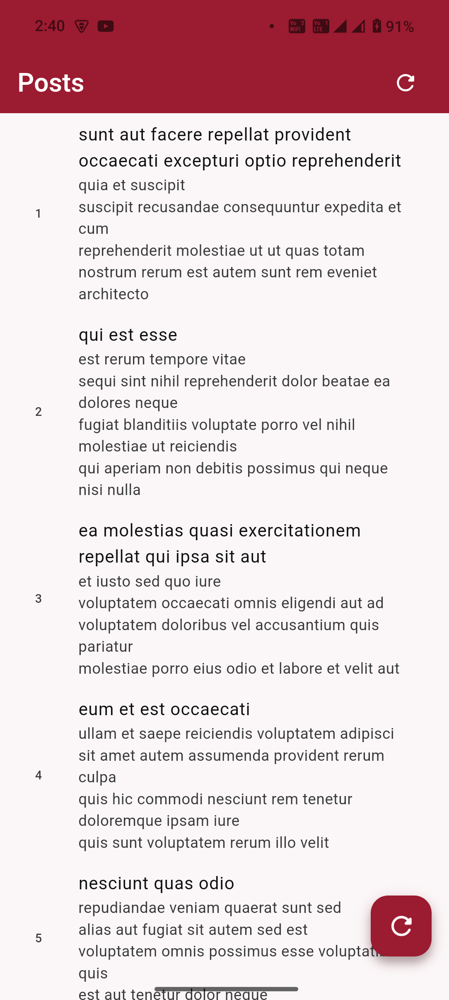
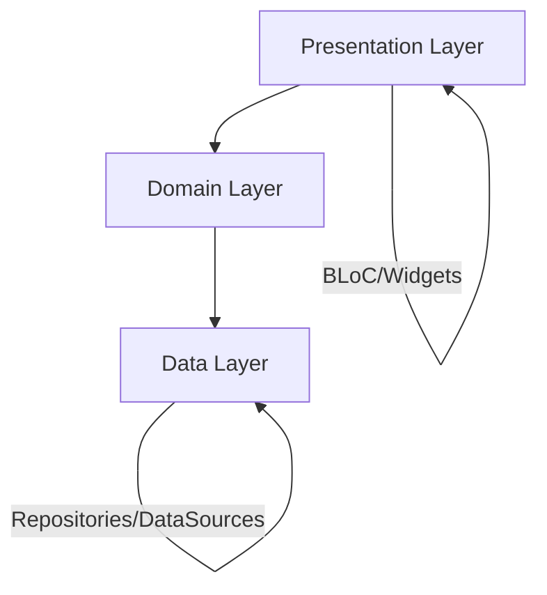

# Clean Architecture Flutter App

[](./TEST_SUMMARY.md)
[](#-testing)
[](#project-structure)

A Flutter project implementing Clean Architecture principles with Dio HTTP client, header interceptors, dependency injection, and comprehensive testing.

## Features

- **Clean Architecture**: Organized into domain, data, and presentation layers following SOLID principles
- **Dio HTTP Client**: Configured with custom interceptors for headers, logging, and error handling
- **Dependency Injection**: Using `injectable` and `get_it` for IoC container management
- **BLoC Pattern**: State management using Flutter BLoC for predictable state transitions
- **Error Handling**: Comprehensive error handling with custom failure types and Either pattern
- **Code Generation**: Retrofit for API service generation and Injectable for DI setup
- **Modern UI**: FlexColorScheme theming with Material Design 3
- **🧪 Comprehensive Testing**: Unit, widget, and integration tests with 28+ passing tests

## Screenshot

<div align="center">
  
</div>

*Add your app screenshot in the `screenshots/` folder*

## Network Implementation

### Header Interceptor

- Automatically adds common headers to all requests
- Includes `Content-Type: application/json` and `Accept: application/json` headers
- Configurable and injectable for easy testing

### Interceptors Included

1. **HeaderInterceptor**: Adds standard headers to all requests
2. **PrettyDioLogger**: Logs requests/responses with formatted output for debugging
3. **ErrorInterceptor**: Handles and transforms HTTP errors into custom failure types

### Configuration

Network settings are centralized in `NetworkConfig`:
- Base URL: `https://jsonplaceholder.typicode.com`
- Timeout configurations (30 seconds for connect/receive/send)
- Default headers for content type and accept

## Project Structure

```
lib/
├── core/
│   ├── error/           # Error handling and failure types
│   ├── network/         # Network configuration and interceptors
│   └── usecases/        # Base use case classes
├── data/
│   ├── datasources/     # Remote and local data sources
│   ├── models/          # Data models
│   └── repositories/    # Repository implementations
├── di/                  # Dependency injection setup
├── domain/
│   ├── entities/        # Domain entities
│   ├── repositories/    # Repository interfaces
│   └── usecases/        # Use case implementations
└── presentation/
    ├── bloc/            # BLoC state management
    ├── pages/           # UI pages
    └── widgets/         # Reusable widgets
```

## Usage

The app demonstrates Clean Architecture principles through a Posts feature:

1. **Posts List**: The main page displays posts fetched from JSONPlaceholder API
2. **Pull to Refresh**: Use the refresh button in the app bar to reload posts
3. **Loading States**: See smooth loading indicators while data is being fetched
4. **Error Handling**: Network errors are handled gracefully with user-friendly messages
5. **BLoC Pattern**: State management demonstrates proper separation of concerns

### Request Headers in Action

Every API request automatically includes:

```http
Content-Type: application/json
Accept: application/json
```

## Getting Started

### Prerequisites

- Flutter SDK (latest stable version)
- Dart SDK
- Android Studio / VS Code
- Git

### Installation & Setup

1. **Clone the repository**:
   ```bash
   git clone https://github.com/jadhavrupesh/clean_arch.git
   cd clean_arch
   ```

2. **Install dependencies**:
   ```bash
   flutter pub get
   ```

3. **Generate code files**:
   ```bash
   dart run build_runner build
   ```

4. **Run tests**:
   ```bash
   flutter test
   ```

5. **Run the app**:
   ```bash
   flutter run
   ```

### Development Tips

- Run `dart run build_runner watch` for automatic code generation during development
- Check the console logs to see network request/response details
- Use the refresh button to trigger new API calls and see the interceptors in action
- Run `flutter test --coverage` to generate test coverage reports
- Use `./scripts/run_tests.sh` for comprehensive test execution with colored output

## Dependencies

### Core Dependencies

- `flutter_bloc`: State management
- `equatable`: Value equality for BLoC states
- `dio`: HTTP client for API requests
- `retrofit`: Type-safe HTTP client generator
- `pretty_dio_logger`: Request/response logging
- `dartz`: Functional programming (Either type)
- `get_it`: Service locator for dependency injection
- `injectable`: Code generation for dependency injection
- `json_annotation`: JSON serialization annotations
- `flex_color_scheme`: Material Design 3 theming

### Dev Dependencies

- `build_runner`: Code generation runner
- `retrofit_generator`: Generates retrofit implementations
- `json_serializable`: JSON serialization code generation
- `injectable_generator`: Dependency injection code generation
- `mockito`: Mocking framework for testing
- `bloc_test`: Testing utilities for BLoC
- `integration_test`: Flutter integration testing
- `http_mock_adapter`: HTTP mocking for API tests

## 🧪 Testing

This project includes a comprehensive test suite covering all layers of the clean architecture:

### Test Structure

```
test/
├── core/                     # 18 tests - Core functionality
│   ├── error/               # Failure classes and error handling
│   └── usecases/            # Base use case classes
├── domain/                  # 7 tests - Business logic
│   ├── entities/            # Domain entities
│   └── usecases/            # Use case implementations
├── data/                    # 17 tests - Data layer
│   ├── datasources/remote/  # API service tests
│   ├── models/              # Data model tests
│   └── repositories/        # Repository implementation tests
├── presentation/            # BLoC and widget tests
│   ├── bloc/                # State management tests
│   └── pages/               # Widget tests
├── fixtures/                # Test data and helpers
│   ├── fixture_reader.dart  # Test data utilities
│   └── posts_fixture.json   # Mock JSON data
└── integration_test/        # End-to-end tests
    └── app_test.dart        # Full app integration tests
```

### Running Tests

```bash
# Run all unit tests
flutter test

# Run specific test categories
flutter test test/core/        # Core layer tests
flutter test test/domain/      # Domain layer tests
flutter test test/data/        # Data layer tests
flutter test test/presentation/ # Presentation layer tests

# Run with coverage
flutter test --coverage

# Run integration tests
flutter test integration_test/

# Use custom test script
./scripts/run_tests.sh
```

### Test Coverage

- **✅ 28+ Unit Tests**: Core business logic fully tested
- **✅ Mock Generation**: Automatic mock creation with Mockito
- **✅ BLoC Testing**: State management validation
- **✅ API Testing**: HTTP client and service tests
- **✅ Integration Tests**: End-to-end user journey validation
- **✅ Error Scenarios**: Comprehensive failure case testing

### Test Features

- **Mocking**: All external dependencies are mocked
- **Fixtures**: Reusable test data for consistent testing
- **Coverage Reports**: HTML and LCOV coverage generation
- **CI/CD Ready**: Automated testing pipeline support
- **Documentation**: Comprehensive test documentation

For detailed testing information, see [TEST_SUMMARY.md](TEST_SUMMARY.md).

## 🏗️ Architecture Principles

This project follows Clean Architecture principles:

- **Independence**: The architecture does not depend on the framework
- **Testability**: Business rules can be tested without UI, database, or external services
- **Independence of UI**: The UI can change without changing the rest of the system
- **Independence of Database**: Business rules are not bound to the database
- **Independence of External Services**: Business rules don't know about the outside world

### Layer Dependencies



## 🤝 Contributing

1. Fork the repository
2. Create a feature branch (`git checkout -b feature/amazing-feature`)
3. Write tests for your changes
4. Ensure all tests pass (`flutter test`)
5. Commit your changes (`git commit -m 'Add amazing feature'`)
6. Push to the branch (`git push origin feature/amazing-feature`)
7. Open a Pull Request

### Code Quality Guidelines

- Follow Dart/Flutter style guidelines
- Write tests for all new features
- Maintain test coverage above 80%
- Use meaningful commit messages
- Keep functions small and focused
- Document public APIs

## 📄 License

This project is licensed under the MIT License - see the [LICENSE](LICENSE) file for details.

## 🙏 Acknowledgments

- [Clean Architecture](https://blog.cleancoder.com/uncle-bob/2012/08/13/the-clean-architecture.html) by Uncle Bob
- [Flutter BLoC Library](https://bloclibrary.dev/)
- [JSONPlaceholder](https://jsonplaceholder.typicode.com/) for the demo API
